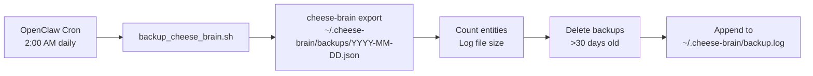

# Cheese Brain - Backup & Recovery Guide

**Last Updated:** 2026-02-17  
**Database Location:** `~/.cheese-brain/cheese-brain.duckdb`  
**Backup Location:** `~/.cheese-brain/backups/`

---

## 📦 Backup Strategy

### Daily Automated Backups

**What:** Full database export to JSON  
**When:** Daily at 2:00 AM CST (OpenClaw cron job)  
**Where:** `~/.cheese-brain/backups/YYYY-MM-DD.json`  
**Retention:** 30 days (automatic cleanup)  
**Format:** JSON (human-readable, portable)  

**Why JSON?**
- Human-readable (can inspect with `cat`, `jq`, text editor)
- Git-friendly (if you later want to track in private repo)
- Portable (restore on any system with Cheese Brain installed)
- Complete (all entities, tags, metadata, audit log)

### Security

✅ **Local only** - Backups never leave your machine  
✅ **No cloud sync** - Stays in `~/.cheese-brain/backups/`  
✅ **Protected by filesystem permissions** - Only your user can read  

**Off-machine backup (manual):**
- Copy latest backup to Time Machine (automatic if enabled)
- Copy to external drive (weekly recommended)
- Copy to iCloud Drive (if you trust Apple with the data)

---

## 🔧 How It Works

### Automated Backup Flow



### Script Location

**Path:** `/Users/sloth/.openclaw/workspace/scripts/backup_cheese_brain.sh`

**What it does:**
1. Activates Cheese Brain virtual environment
2. Exports database: `cheese-brain export ~/.cheese-brain/backups/YYYY-MM-DD.json`
3. Logs result (entity count, file size)
4. Deletes backups older than 30 days
5. Reports summary stats

**Logs:** `~/.cheese-brain/backup.log`

---

## 🚀 Setup Instructions

### 1. Verify Script is Executable

```bash
ls -l /Users/sloth/.openclaw/workspace/scripts/backup_cheese_brain.sh
# Should show: -rwxr-xr-x (executable)
```

If not executable:
```bash
chmod +x /Users/sloth/.openclaw/workspace/scripts/backup_cheese_brain.sh
```

### 2. Test Manual Backup

```bash
# Run backup script manually
/Users/sloth/.openclaw/workspace/scripts/backup_cheese_brain.sh
```

**Expected output:**
```
[2026-02-17 09:30:45] Starting Cheese Brain backup...
[2026-02-17 09:30:45] Exporting to /Users/sloth/.cheese-brain/backups/2026-02-17.json...
✅ Exported 44 entities to /Users/sloth/.cheese-brain/backups/2026-02-17.json
[2026-02-17 09:30:46] ✅ Backup successful: 44 entities, 128K
[2026-02-17 09:30:46] Cleaning up backups older than 30 days...
[2026-02-17 09:30:46] No old backups to delete
[2026-02-17 09:30:46] Backup complete. Total backups: 1, Total size: 128K
```

### 3. Verify Backup File

```bash
# Check backup exists
ls -lh ~/.cheese-brain/backups/

# Inspect backup (pretty-print first entity)
cat ~/.cheese-brain/backups/$(date +%Y-%m-%d).json | jq '.[0]'

# Count entities in backup
cat ~/.cheese-brain/backups/$(date +%Y-%m-%d).json | jq 'length'
```

### 4. Set Up OpenClaw Cron Job

**Add to OpenClaw:**
```bash
# Use OpenClaw cron tool
cron add \
  --name "Cheese Brain Daily Backup" \
  --schedule "0 2 * * *" \
  --timezone "America/Chicago" \
  --payload-kind "systemEvent" \
  --payload-text "Run Cheese Brain backup: /Users/sloth/.openclaw/workspace/scripts/backup_cheese_brain.sh"
```

**Or manually add to `openclaw.json` cron section:**
```json
{
  "name": "Cheese Brain Daily Backup",
  "schedule": {
    "kind": "cron",
    "expr": "0 2 * * *",
    "tz": "America/Chicago"
  },
  "payload": {
    "kind": "systemEvent",
    "text": "Run Cheese Brain backup: /Users/sloth/.openclaw/workspace/scripts/backup_cheese_brain.sh"
  },
  "sessionTarget": "main",
  "enabled": true
}
```

**Verify cron job:**
```bash
cron list
# Should show: Cheese Brain Daily Backup (enabled)
```

---

## 🔄 Recovery Procedures

### Scenario 1: Full Database Restore

**When:** Database file corrupted, accidentally deleted, or rolled back needed

**Steps:**

1. **Stop any processes using the database:**
   ```bash
   # Check if cheese-brain is running
   ps aux | grep cheese-brain
   # Kill if needed: kill <pid>
   ```

2. **Backup current database (if exists):**
   ```bash
   mv ~/.cheese-brain/cheese-brain.duckdb ~/.cheese-brain/cheese-brain.duckdb.old
   ```

3. **Choose backup to restore:**
   ```bash
   # List available backups
   ls -lh ~/.cheese-brain/backups/
   
   # Pick the one you want (e.g., 2026-02-17.json)
   ```

4. **Restore from backup:**
   ```bash
   cd /Users/sloth/.openclaw/workspace/cheese-brain
   source venv/bin/activate
   
   # Import backup (this recreates the database)
   cheese-brain restore-backup ~/.cheese-brain/backups/2026-02-17.json
   ```

5. **Verify restore:**
   ```bash
   cheese-brain stats
   # Should show expected entity count
   
   cheese-brain list | head -10
   # Spot-check entities
   
   cheese-brain search "gabby"
   # Test search functionality
   ```

6. **Remove old database backup (if restore successful):**
   ```bash
   rm ~/.cheese-brain/cheese-brain.duckdb.old
   ```

**Recovery time:** ~5 seconds for 44 entities, ~30 seconds for 10k entities

---

### Scenario 2: Selective Restore (Single Entity)

**When:** Accidentally deleted entity, need to recover specific item

**Steps:**

1. **Find the entity in a backup:**
   ```bash
   # Search backup files for entity
   grep -l "SketchySkills" ~/.cheese-brain/backups/*.json
   # Returns: /Users/sloth/.cheese-brain/backups/2026-02-17.json
   ```

2. **Extract entity from backup:**
   ```bash
   # Pretty-print all entities, find the one you want
   cat ~/.cheese-brain/backups/2026-02-17.json | jq '.[] | select(.title == "SketchySkills")'
   
   # Save to file for easier viewing
   cat ~/.cheese-brain/backups/2026-02-17.json | jq '.[] | select(.title == "SketchySkills")' > /tmp/entity.json
   ```

3. **Re-add entity manually:**
   ```bash
   # Read entity details from JSON
   cat /tmp/entity.json
   
   # Re-add with cheese-brain add command
   cheese-brain add project "SketchySkills" \
     --tags "security,shipped,clawhub,nextjs,vercel" \
     --data '{"status":"shipped","live":"https://sketchyskills.vercel.app",...}'
   ```

4. **Or restore soft-deleted entity (if within deleted_at window):**
   ```bash
   # List deleted entities
   cheese-brain list --include-deleted
   
   # Restore by ID
   cheese-brain restore <entity-id>
   ```

---

### Scenario 3: Point-in-Time Recovery

**When:** Need database state from specific date (e.g., before bad bulk edit)

**Steps:**

1. **Identify target date:**
   ```bash
   # List backups
   ls -lh ~/.cheese-brain/backups/
   # Pick date: 2026-02-15.json (before the bad edit)
   ```

2. **Backup current state first:**
   ```bash
   cheese-brain export ~/.cheese-brain/recovery-current-state.json
   ```

3. **Restore from target date:**
   ```bash
   # Follow "Full Database Restore" steps with 2026-02-15.json
   cheese-brain restore-backup ~/.cheese-brain/backups/2026-02-15.json
   ```

4. **Verify and compare:**
   ```bash
   # Check entity counts
   cheese-brain stats
   
   # Compare with current state backup if needed
   diff <(jq -S '.' ~/.cheese-brain/backups/2026-02-15.json) \
        <(jq -S '.' ~/.cheese-brain/recovery-current-state.json)
   ```

---

### Scenario 4: Disaster Recovery (Machine Failure)

**When:** Mac dies, needs restore on new/repaired machine

**Prerequisites:**
- Time Machine backup enabled (includes `~/.cheese-brain/backups/`)
- Or manual copy of backups to external drive

**Steps:**

1. **On new/repaired machine, install Cheese Brain:**
   ```bash
   git clone https://github.com/mhugo22/cheese-brain.git
   cd cheese-brain
   python3 -m venv venv
   source venv/bin/activate
   pip install -e .
   ```

2. **Restore backups from Time Machine:**
   ```bash
   # Copy from Time Machine backup
   cp -r /Volumes/TimeMachine/Backups/.../Users/sloth/.cheese-brain/backups ~/cheese-brain/
   ```

3. **Restore latest backup:**
   ```bash
   # Find most recent backup
   ls -lt ~/.cheese-brain/backups/ | head -5
   
   # Restore
   cheese-brain restore-backup ~/.cheese-brain/backups/2026-02-17.json
   ```

4. **Verify:**
   ```bash
   cheese-brain stats
   cheese-brain search "gabby"
   ```

---

## 🔍 Monitoring & Verification

### Check Backup Status

**View recent backup log:**
```bash
tail -20 ~/.cheese-brain/backup.log
```

**Check backup schedule:**
```bash
cron list | grep "Cheese Brain"
```

**Verify backup ran today:**
```bash
ls -lh ~/.cheese-brain/backups/$(date +%Y-%m-%d).json
# If exists, backup ran successfully
```

### Manual Verification Test

**Run this monthly to ensure backups work:**

```bash
# 1. Export current state
cheese-brain export /tmp/test-backup.json

# 2. Count entities
ENTITIES=$(cat /tmp/test-backup.json | jq 'length')
echo "Backed up $ENTITIES entities"

# 3. Verify file is valid JSON
if jq empty /tmp/test-backup.json 2>/dev/null; then
    echo "✅ Backup is valid JSON"
else
    echo "❌ Backup is corrupted"
fi

# 4. Spot-check entities
cat /tmp/test-backup.json | jq '.[0] | {id, title, category, created_at}'

# 5. Cleanup
rm /tmp/test-backup.json
```

---

## 📊 Backup Statistics

**View backup disk usage:**
```bash
du -sh ~/.cheese-brain/backups/
```

**Count backups:**
```bash
ls ~/.cheese-brain/backups/*.json | wc -l
```

**Oldest backup:**
```bash
ls -lt ~/.cheese-brain/backups/ | tail -5
```

**Growth over time:**
```bash
# Compare backup sizes over last 7 days
for i in {0..6}; do
  DATE=$(date -v-${i}d +%Y-%m-%d)
  FILE="$HOME/.cheese-brain/backups/$DATE.json"
  if [ -f "$FILE" ]; then
    SIZE=$(du -h "$FILE" | cut -f1)
    COUNT=$(cat "$FILE" | jq 'length')
    echo "$DATE: $COUNT entities, $SIZE"
  fi
done
```

---

## 🚨 Troubleshooting

### Backup Failed: "cheese-brain command not found"

**Cause:** Virtual environment not activated

**Fix:**
```bash
# Verify venv exists
ls /Users/sloth/.openclaw/workspace/cheese-brain/venv/

# Manually activate and test
source /Users/sloth/.openclaw/workspace/cheese-brain/venv/bin/activate
cheese-brain --version
```

If venv missing, reinstall:
```bash
cd /Users/sloth/.openclaw/workspace/cheese-brain
python3 -m venv venv
source venv/bin/activate
pip install -e .
```

---

### Backup Failed: "Permission denied"

**Cause:** Backup directory not writable

**Fix:**
```bash
# Check permissions
ls -ld ~/.cheese-brain/backups/

# Fix if needed
chmod 700 ~/.cheese-brain/backups/
```

---

### Restore Failed: "Invalid JSON"

**Cause:** Backup file corrupted

**Fix:**
1. Try previous day's backup
2. Check backup.log for errors during export
3. Verify JSON validity:
   ```bash
   jq empty ~/.cheese-brain/backups/2026-02-17.json
   # If error: backup is corrupted, use older backup
   ```

---

### Cron Job Not Running

**Check cron job status:**
```bash
cron list
# Should show "Cheese Brain Daily Backup" as enabled
```

**Check recent cron runs:**
```bash
cron runs "Cheese Brain Daily Backup"
```

**Check backup log for errors:**
```bash
tail -50 ~/.cheese-brain/backup.log | grep ERROR
```

**Test cron job manually:**
```bash
cron run "Cheese Brain Daily Backup"
# Watch for errors
```

---

## 📋 Maintenance Checklist

### Monthly
- [ ] Verify latest backup exists and is valid JSON
- [ ] Check backup.log for errors
- [ ] Review disk usage (`du -sh ~/.cheese-brain/backups/`)
- [ ] Test restore on temp database (optional but recommended)

### Quarterly
- [ ] Full disaster recovery test (restore on external drive)
- [ ] Review retention policy (30 days sufficient?)
- [ ] Copy latest backup to external drive (off-machine redundancy)

### After Major Changes
- [ ] Manual backup before bulk edits
- [ ] Verify backup after adding many entities
- [ ] Test search/stats after restore

---

## 🔗 Related Documentation

- [TODO.md](TODO.md) - Backup improvements roadmap
- [WHITEPAPER.md](WHITEPAPER.md) - Export/import architecture
- [scripts/README.md](../scripts/README.md) - Automation scripts overview

---

## 📞 Quick Reference

| Task | Command |
|------|---------|
| Manual backup | `/Users/sloth/.openclaw/workspace/scripts/backup_cheese_brain.sh` |
| List backups | `ls -lh ~/.cheese-brain/backups/` |
| View backup log | `tail -20 ~/.cheese-brain/backup.log` |
| Full restore | `cheese-brain restore-backup ~/.cheese-brain/backups/YYYY-MM-DD.json` |
| Verify backup | `jq 'length' ~/.cheese-brain/backups/YYYY-MM-DD.json` |
| Check cron | `cron list \| grep "Cheese Brain"` |
| Disk usage | `du -sh ~/.cheese-brain/backups/` |

---

**Questions or issues?** Check troubleshooting section or update this doc with new learnings.
